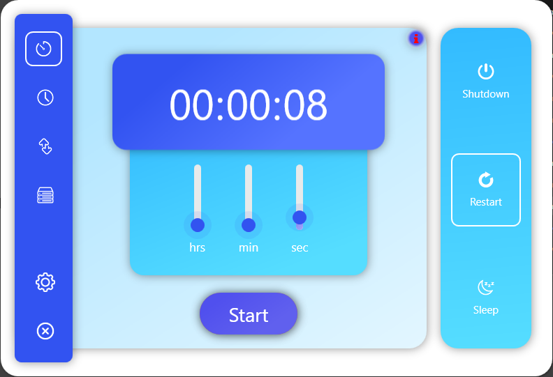
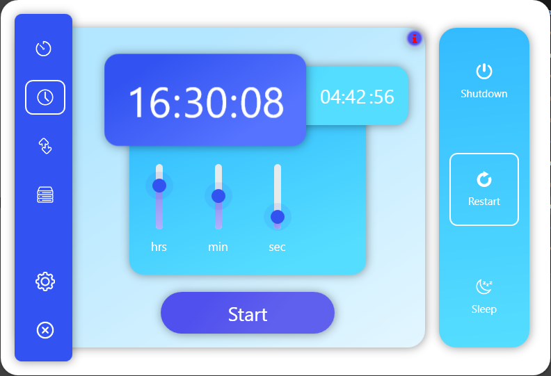
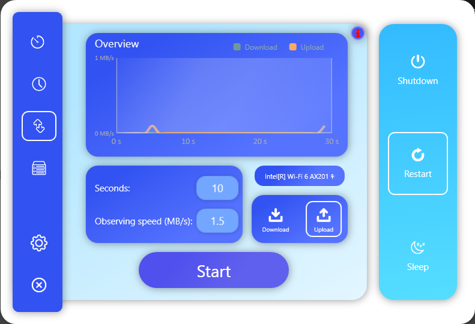
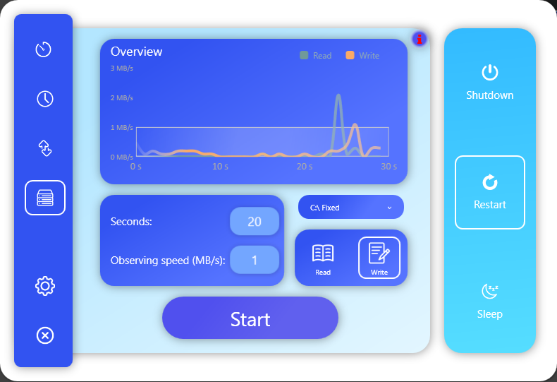

# ShutdownController

ShutdownController is a little tool to manage the time when the PC should shut down, go in Sleep Mode or Restart the PC.

## Features include:

### General
- You can choose between Sleep Mode, Restart or ShutdownManager
- The tool generates a trayicon and you will get some balloon tips
- If you want, you can add the tool to the startup, by pressing the button in the taskbar.
- When its added to startup and you close the MainWindow, it still running in the taskbar, when you set the option.

### Timer

- The timer can be set precisely
- You can press some button to stop, pause or to play the timer
- The time and speed which controlls the shutdown time can be adjusted.

### Clock

### Download/Upload observing
- You can also shut down your PC by observing your Down/Upload speed. 

### Disk Read/Write observing

## Screenshots

    
	
	
	

